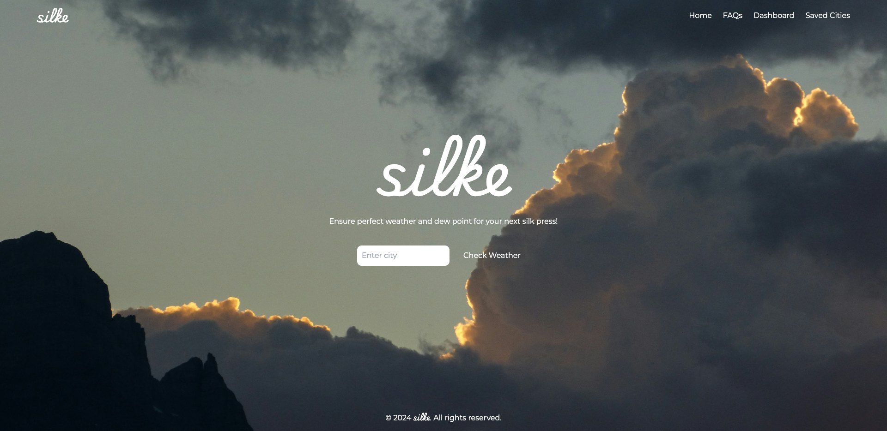
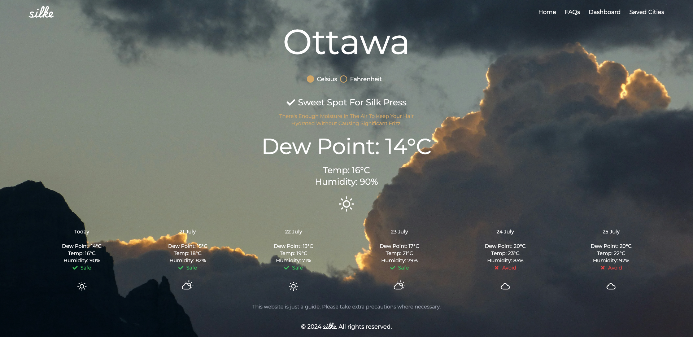
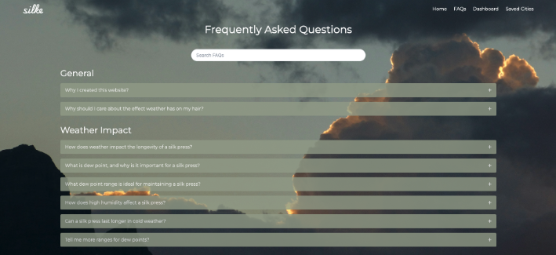
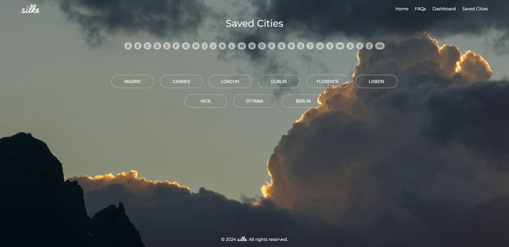

# Silke - Weather Guide for Silk Press

Welcome to Silke! This project helps individuals with textured hair determine the best time to get a silk press based on current weather conditions, particularly focusing on the dew point.

## Table of Contents

- [Introduction](#introduction)
- [Features](#features)
- [Getting Started](#getting-started)
- [Usage](#usage)
- [Screenshots](#screenshots)
- [Live Demo](#live-demo)
- [FAQ](#faq)
- [Contributing](#contributing)
- [License](#license)

## Introduction

Managing textured hair can be challenging, especially with varying weather conditions. Silke aims to provide the necessary information to make informed decisions about hair care, particularly when it comes to achieving the perfect silk press. 

## Features

- **Current Weather Information**: Displays current temperature, humidity, and dew point.
- **5-Day Weather Forecast**: Provides a 5-day forecast with relevant weather details.
- **Silk Press Suitability**: Indicates if the current weather conditions are suitable for a silk press.
- **Unit Selection**: Allows users to switch between Celsius and Fahrenheit.
- **Searchable FAQs**: Provides answers to common questions about how weather affects a silk press.
- **Saved Cities**: Users can save their preferred cities for quick access.

## Getting Started

### Prerequisites

- Node.js (v14 or later)
- npm or yarn

### Installation

1. Clone the repository:

```sh
git clone https://github.com/yourusername/silke.git
cd silke
```

2. Install dependencies:

```sh
npm install
# or
yarn install
```

3. Create a `.env.local` file in the root directory and add your API key for weather data:

```sh
NEXT_PUBLIC_WEATHER_API_KEY=your_api_key_here
```

4. Start the development server:

```sh
npm run dev
# or
yarn dev
```

5. Open [http://localhost:3000](http://localhost:3000) with your browser to see the result.

## Usage

- **Search for a city**: Enter a city name to get the current weather and 5-day forecast.
- **Check Silk Press Suitability**: The app will indicate if the weather conditions are suitable for a silk press based on the dew point.
- **Save Cities**: Save your favorite cities for quick access.
- **Switch Units**: Toggle between Celsius and Fahrenheit for temperature and dew point.

## Screenshots

### Home Page



### Dashboard



### FAQs



### Saved Cities



## Live Demo

Check out the live demo of Silke [here](https://silke.vercel.app/).

## FAQ

### Why should I care about the effect weather has on my hair?

Understanding the relationship between weather, dew points, and hair styling is crucial for maintaining healthy and beautiful textured hair. Dew points, humidity, and temperature can all impact how well your hair maintains a silk press.

### How does weather impact the longevity of a silk press?

Weather conditions, particularly humidity and dew point, can significantly affect a silk press. High humidity and high dew points can cause hair to absorb moisture from the air, leading to frizz and reversion to its natural texture.

### What is dew point, and why is it important for a silk press?

Dew point is the temperature at which air becomes saturated with moisture and dew forms. It’s crucial for a silk press because when the dew point is high, there is more moisture in the air, which can cause the hair to swell and revert back to curls or waves.

### How does high humidity affect a silk press?

High humidity means there is a lot of moisture in the air, which can cause hair to absorb this moisture. This leads to swelling of the hair shaft, frizz, and eventually, the hair reverting to its natural curl pattern, thus shortening the longevity of a silk press.

## Contributing

Contributions are welcome! Please follow these steps:

1. Fork the repository.
2. Create a new branch (`git checkout -b feature/your-feature-name`).
3. Make your changes.
4. Commit your changes (`git commit -m 'Add some feature'`).
5. Push to the branch (`git push origin feature/your-feature-name`).
6. Open a pull request.

## License

This project is licensed under the MIT License - see the [LICENSE](LICENSE) file for details.

---

Thank you for using Silke! If you have any questions or feedback, feel free to open an issue or contact us. Happy hair styling!

---

For more details on the available features and their usage, please refer to the [live demo](https://silke.vercel.app/).